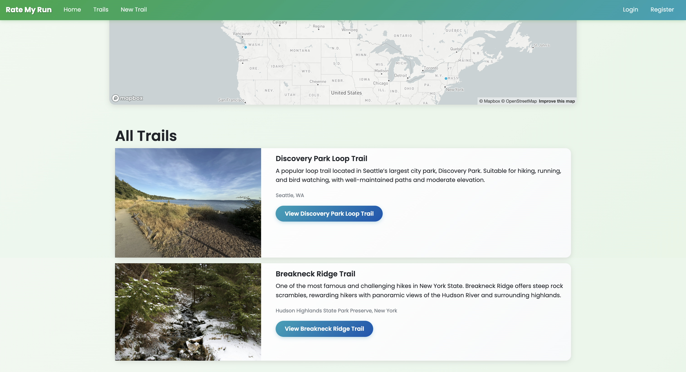
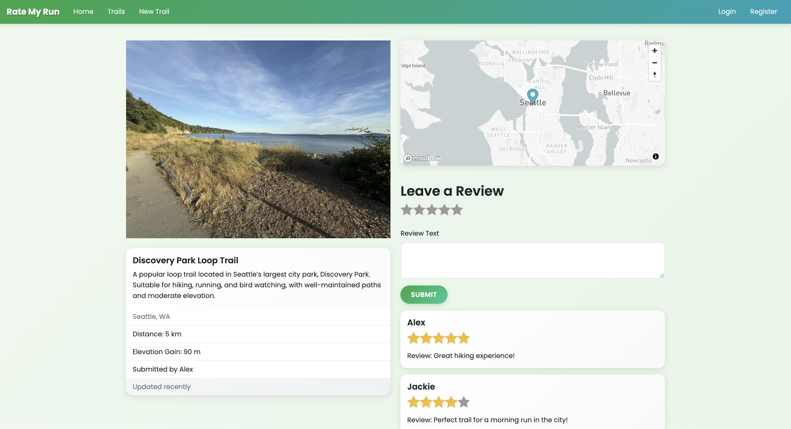

# RateMyRun 🏃‍♀️🌲

**RateMyRun** is a full-stack web application for discovering, sharing, and reviewing running trails.  
It allows users to explore trails on an interactive map, upload photos, and share their experiences with the running community.

## Features
- 🔐 **User Authentication**: Register, log in, and log out securely
- 🏞 **Trail Management**: Create, edit, and delete running trails
- 🖼 **Image Uploads**: Upload and manage trail photos with Cloudinary
- 🗺 **Interactive Maps**: Visualize trail locations using Mapbox
- ⭐ **Reviews & Ratings**: Leave reviews with star ratings for trails
- 🛡 **Security**: Input validation, sanitization, and secure sessions
- 📱 **Responsive UI**: Styled with Bootstrap and custom CSS

## Tech Stack
- **Backend:** Node.js, Express, MongoDB, Mongoose  
- **Frontend:** EJS templates, Bootstrap, custom CSS  
- **Authentication:** Passport.js, passport-local-mongoose  
- **APIs:** Mapbox Geocoding API, Cloudinary  
- **Security:** Helmet, express-mongo-sanitize  
- **Validation:** Joi + sanitize-html  

## Installation & Setup

1. **Clone the repository**
   ```bash
   git clone https://github.com/helloxujc/rate-my-run.git
   cd rate-my-run
   ```

2. **Install dependencies**
   ```bash
   npm install
   ```

3. **Create a `.env` file** in the root directory and add the following:
   ```
   DB_URL=mongodb://localhost:27017/ratemyrun
   MAPBOX_TOKEN=your_mapbox_token
   CLOUDINARY_CLOUD_NAME=your_cloudinary_name
   CLOUDINARY_KEY=your_cloudinary_key
   CLOUDINARY_SECRET=your_cloudinary_secret
   SECRET=your_session_secret
   ```

4. **Run the app**
   ```bash
   npm start
   ```
   The app will be running at:  
   👉 `http://localhost:3000`


## Project Structure
```
├── models/          # Mongoose models (User, Trail, Review)
├── routes/          # Express route definitions
├── controllers/     # Business logic for routes
├── public/          # CSS, JS, and static assets
├── views/           # EJS templates
├── app.js           # Main Express app
├── package.json
└── README.md
```

## 📸 Screenshots



